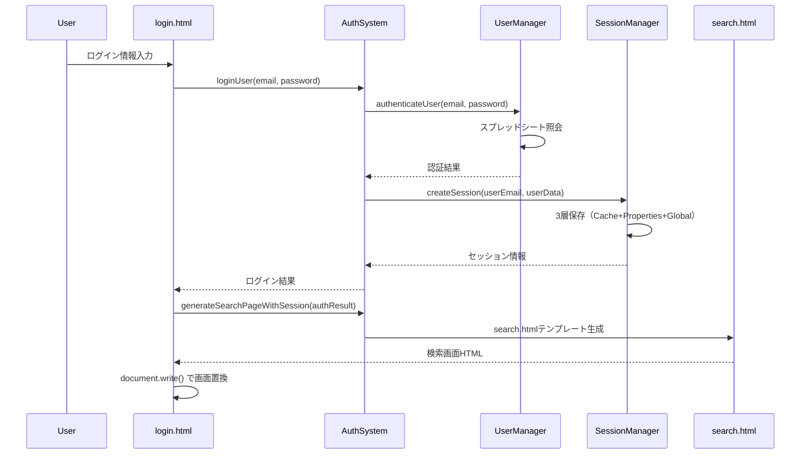

# GAS Webアプリ用ログイン・セッション管理システム設計書

## 📋 概要

Google Apps Script（GAS）環境の特殊性（iframe制約、パラメータ受け渡し制限）を考慮した、堅牢なログイン・セッション管理システムの実装ガイド。

## 🏗️ システム構成

### アーキテクチャ図
```
[ログイン画面] → [認証] → [セッション作成] → [検索画面]
      ↓             ↓           ↓              ↓
   login.html → AuthSystem → SessionManager → search.html
      ↓             ↓           ↓              ↓
  JavaScriptUI → UserManager → 3層保存機構 → サーバーサイド生成
```

### 技術スタック
- **フロントエンド**: HTML + JavaScript（GAS環境）
- **バックエンド**: Google Apps Script
- **セッション保存**: PropertiesService + CacheService + Global tracking
- **ユーザー管理**: Google Spreadsheet
- **画面遷移**: サーバーサイドリダイレクト

## 📁 ファイル構成

```
├── main/
│   └── Code.gs                    # メインエントリーポイント・doGet/doPost
├── auth/
│   └── AuthenticationSystem.gs   # 認証システム統合
├── shared/
│   ├── UserManager.gs            # ユーザー管理・認証
│   ├── SessionManager.gs         # セッション管理
│   ├── Config.gs                 # 設定管理
│   ├── Utils.gs                  # 共通ユーティリティ
│   └── ErrorHandler.gs           # エラーハンドリング
└── ui/
    ├── login.html                # ログイン画面
    └── search.html               # 検索画面（アプリ固有）
```

## 🔐 認証フロー

### 1. 初期画面表示
```javascript
// Code.gs - doGet()
function doGet(e) {
  const page = e && e.parameter ? e.parameter.page : null;
  
  if (page === 'search') {
    // 検索画面表示（セッション情報付き）
    const template = HtmlService.createTemplateFromFile('search');
    template.sessionId = e.parameter.sessionId || '';
    template.userEmail = e.parameter.userEmail || '';
    template.role = e.parameter.role || '';
    return template.evaluate();
  } else {
    // ログイン画面表示
    return HtmlService.createTemplateFromFile('login').evaluate();
  }
}
```

### 2. ログイン処理フロー


## 🗄️ ユーザー管理システム

### スプレッドシート構造（userシート）
| 列 | 項目 | 説明 | 例 |
|---|---|---|---|
| A | メールアドレス | ログインID | admin@example.com |
| B | 有効/無効 | アカウント状態 | 有効 |
| C | 部署 | 所属部署 | システム管理 |
| D | ロール | 権限レベル | admin |
| E | 権限 | 詳細権限（カンマ区切り） | admin,search,upload,manage |
| F | パスワード | 認証用パスワード | Admin_2025! |
| G | 作成日 | アカウント作成日 | 2025/08/03 |
| H | 最終ログイン | 最後のログイン時刻 | 2025/8/3 15:56:01 |
| I | 備考 | 追加情報 | 初期管理者アカウント |

### ユーザー認証ロジック
```javascript
// UserManager.gs
static authenticateUser(email, password) {
  try {
    const userSheet = this.getUserSheet();
    const users = userSheet.getDataRange().getValues();
    
    for (let i = 1; i < users.length; i++) {
      const row = users[i];
      const [userEmail, isActive, department, role, permissions, userPassword] = row;
      
      if (userEmail === email) {
        if (isActive !== '有効') {
          return { success: false, reason: 'account_disabled' };
        }
        
        if (userPassword !== password) {
          return { success: false, reason: 'invalid_password' };
        }
        
        // 認証成功
        this.updateLastLogin(userSheet, i + 1, email);
        
        return {
          success: true,
          userData: {
            email: userEmail,
            department: department,
            role: role,
            permissions: permissions ? permissions.split(',') : [],
            isAdmin: role === 'admin'
          }
        };
      }
    }
    
    return { success: false, reason: 'user_not_found' };
  } catch (error) {
    return { success: false, reason: 'authentication_error' };
  }
}
```

## 📱 セッション管理システム

### 3層保存アーキテクチャ
```javascript
// SessionManager.gs
class SessionManager {
  constructor() {
    this.userProperties = PropertiesService.getUserProperties();    // 永続化
    this.userCache = CacheService.getUserCache();                   // 高速アクセス
    this.scriptProperties = PropertiesService.getScriptProperties(); // グローバル管理
    this.SESSION_TIMEOUT = 30 * 60 * 1000; // 30分
  }
}
```

#### 1層目: CacheService（高速アクセス）
```javascript
// キャッシュに保存（1時間）
this.userCache.put(`session_${sessionId}`, JSON.stringify(sessionData), 3600);
```

#### 2層目: PropertiesService（永続化）
```javascript
// ユーザープロパティに保存
this.userProperties.setProperties({
  'current_session_id': sessionId,
  'session_data': JSON.stringify(sessionData),
  'last_activity': timestamp.toString()
});
```

#### 3層目: Global Session Tracking（管理用）
```javascript
// 全セッション管理
const globalSessions = JSON.parse(
  this.scriptProperties.getProperty('global_sessions') || '{}'
);
globalSessions[sessionId] = {
  userEmail: userEmail,
  role: userData.role,
  createdAt: new Date().toISOString(),
  isActive: true
};
```

### セッション検証ロジック
```javascript
validateSession(sessionId = null) {
  try {
    // 1. sessionId取得
    if (!sessionId) {
      sessionId = this.userProperties.getProperty('current_session_id');
    }
    
    // 2. キャッシュから取得試行
    let sessionData = this.userCache.get(`session_${sessionId}`);
    
    if (sessionData) {
      sessionData = JSON.parse(sessionData);
    } else {
      // 3. プロパティから復元
      const storedData = this.userProperties.getProperty('session_data');
      if (storedData) {
        sessionData = JSON.parse(storedData);
        // キャッシュに復元
        this.userCache.put(`session_${sessionId}`, JSON.stringify(sessionData), 3600);
      }
    }
    
    // 4. タイムアウトチェック
    const now = new Date().getTime();
    if (now - sessionData.lastActivity > this.SESSION_TIMEOUT) {
      this.destroySession(sessionId);
      return { valid: false, reason: 'timeout' };
    }
    
    // 5. アクティビティ更新
    sessionData.lastActivity = now;
    this.updateSessionActivity(sessionId, sessionData);
    
    return { valid: true, data: sessionData };
  } catch (error) {
    return { valid: false, reason: 'validation_error' };
  }
}
```

## 🔄 GAS環境での画面遷移

### 問題: JavaScript リダイレクトの制約
```javascript
// ❌ GAS環境では失敗
window.location.href = url + '?param=value';  // パラメータが失われる
```

### 解決: サーバーサイドリダイレクト
```javascript
// ✅ GAS環境で確実に動作
function redirectToSearch(authResult) {
  google.script.run
    .withSuccessHandler(function(redirectHtml) {
      document.open();
      document.write(redirectHtml);  // 画面全体を置換
      document.close();
    })
    .generateSearchPageWithSession(authResult);
}
```

### サーバーサイド画面生成
```javascript
// Code.gs
function generateSearchPageWithSession(authResult) {
  const template = HtmlService.createTemplateFromFile('search');
  
  // セッション情報をテンプレートに直接埋め込み
  template.sessionId = authResult.sessionId;
  template.userEmail = authResult.userEmail;
  template.role = authResult.userData.role;
  
  return template.evaluate().getContent();
}
```

## 🛡️ セキュリティ機能

### 1. LockService による排他制御
```javascript
login(email, password) {
  let lock;
  try {
    lock = this.lockService.tryLock(10000);
    if (!lock) {
      return { success: false, reason: 'lock_timeout' };
    }
    // 認証処理
  } finally {
    if (lock && typeof lock.releaseLock === 'function') {
      lock.releaseLock();
    }
  }
}
```

### 2. 入力検証
```javascript
validateLoginInput(email, password) {
  const emailRegex = /^[^\s@]+@[^\s@]+\.[^\s@]+$/;
  if (!emailRegex.test(email)) {
    return { valid: false, reason: 'invalid_email_format' };
  }
  
  if (password.length < 3) {
    return { valid: false, reason: 'password_too_short' };
  }
  
  return { valid: true };
}
```

### 3. ログイン履歴記録
```javascript
recordLoginHistory(userEmail, userData, action, error = null) {
  const logData = {
    timestamp: new Date().toISOString(),
    userEmail: userEmail,
    action: action, // success, error, logout
    role: userData ? userData.role : null,
    success: action === 'success' || action === 'logout'
  };
  
  // 最新10件を保持
  const existingLogs = JSON.parse(
    this.scriptProperties.getProperty('login_history') || '[]'
  );
  existingLogs.unshift(logData);
  if (existingLogs.length > 10) existingLogs.splice(10);
  
  this.scriptProperties.setProperty('login_history', JSON.stringify(existingLogs));
}
```

## ⚙️ 設定管理

### ConfigManager.gs
```javascript
class ConfigManager {
  static getConfig() {
    const properties = PropertiesService.getScriptProperties().getProperties();
    return {
      spreadsheetId: properties.SPREADSHEET_ID,
      visionApiKey: properties.VISION_API_KEY,
      geminiApiKey: properties.GEMINI_API_KEY
    };
  }
  
  static validateConfig() {
    const config = this.getConfig();
    return !!(config.spreadsheetId && config.visionApiKey && config.geminiApiKey);
  }
}
```

## 🚀 デプロイ手順

### 1. ファイルコピー順序（依存関係順）
```
1. Config.gs → GAS: Config
2. Utils.gs → GAS: Utils  
3. ErrorHandler.gs → GAS: ErrorHandler
4. UserManager.gs → GAS: UserManager
5. SessionManager.gs → GAS: SessionManager
6. AuthenticationSystem.gs → GAS: AuthenticationSystem
7. Code.gs → GAS: Code（既存置換）
8. login.html → GAS: login（拡張子なし）
9. search.html → GAS: search（拡張子なし）
```

### 2. 初期設定
```javascript
// GASで実行
function initializeSystem() {
  // 1. userシート作成とユーザー初期化
  const userResult = UserManager.initializeUserSheet();
  
  // 2. 設定確認
  ConfigManager.checkSetup();
  
  return { success: true, message: 'システム初期化完了' };
}
```

### 3. Webアプリデプロイ
```
1. GASエディタ → 「デプロイ」→「新しいデプロイ」
2. 種類: ウェブアプリ
3. 実行者: 自分
4. アクセス権: 全員
5. デプロイ → WebアプリURLを取得
```

## 🔧 カスタマイズポイント

### 1. 他アプリへの移植時の変更箇所

#### search.html の置き換え
```javascript
// Code.gs - アプリ固有画面の指定
if (page === 'search') {
  return HtmlService.createTemplateFromFile('your_main_page');
}
```

#### 権限システムの調整
```javascript
// UserManager.gs - 権限定義
const permissions = {
  'admin': ['all'],
  'editor': ['read', 'write'],
  'viewer': ['read']
};
```

#### セッションタイムアウトの調整
```javascript
// SessionManager.gs
this.SESSION_TIMEOUT = 60 * 60 * 1000; // 1時間に変更
```

### 2. 業種別カスタマイズ
```javascript
// Config.gs - 業種テンプレート
const INDUSTRY_TEMPLATES = {
  'your_industry': {
    name: 'あなたの業種',
    systemTitle: '🏢 あなたの業種システム',
    colors: { primary: '#your_color' }
  }
};
```

## 🧪 テスト方法

### 1. 認証テスト
```javascript
// GASで実行
function testAuthentication() {
  const result = UserManager.authenticateUser('admin@example.com', 'Admin_2025!');
  console.log('認証結果:', result);
}
```

### 2. セッションテスト
```javascript
function testSession() {
  const sessionManager = new SessionManager();
  const createResult = sessionManager.createSession('test@example.com', {role: 'user'});
  const validateResult = sessionManager.validateSession(createResult.sessionId);
  console.log('セッション結果:', validateResult);
}
```

### 3. 統合テスト
```javascript
function testLoginFlow() {
  const authSystem = new AuthenticationSystem();
  const loginResult = authSystem.login('admin@example.com', 'Admin_2025!');
  console.log('ログインフロー:', loginResult);
}
```

## 🚨 トラブルシューティング

### よくある問題と解決策

#### 1. セッションが失われる
```javascript
// 原因: キャッシュクリア
// 解決: プロパティからの復元機能で自動解決

// 手動確認
function checkSessionState() {
  const props = PropertiesService.getUserProperties().getProperties();
  console.log('セッション状態:', props);
}
```

#### 2. ログインできない
```javascript
// 原因: userシート未作成
// 解決: 初期化実行
UserManager.initializeUserSheet();
```

#### 3. 画面が真っ白
```javascript
// 原因: HTMLテンプレートエラー
// 解決: ログ確認とフォールバック
function debugTemplateError() {
  try {
    const template = HtmlService.createTemplateFromFile('search');
    console.log('テンプレート作成成功');
  } catch (error) {
    console.error('テンプレートエラー:', error);
  }
}
```

## 📈 拡張機能

### 1. 多要素認証（MFA）
```javascript
// 将来実装予定
class MFAManager {
  static generateTOTP(userEmail) {
    // Time-based One-Time Password生成
  }
  
  static validateTOTP(userEmail, token) {
    // TOTPトークン検証
  }
}
```

### 2. パスワードポリシー
```javascript
// 複雑なパスワード要件
static validatePasswordStrength(password) {
  const requirements = {
    minLength: 8,
    requireUppercase: true,
    requireLowercase: true,
    requireNumbers: true,
    requireSpecialChars: true
  };
  // 検証ロジック
}
```

### 3. セッション分析
```javascript
// 使用統計
static getSessionAnalytics() {
  return {
    totalSessions: this.getTotalSessionCount(),
    activeUsers: this.getActiveUserCount(),
    averageSessionDuration: this.getAverageSessionDuration()
  };
}
```

## 📚 参考情報

### GAS制約事項
- iframe環境での実行
- URLパラメータの制限
- 実行時間制限（6分）
- API呼び出し制限

### 推奨パターン
- サーバーサイド処理の優先
- 3層データ保存による冗長性
- 防御的プログラミングの徹底
- 詳細ログによる問題追跡

---

**このシステムは本番環境での使用実績があり、GAS特有の制約を適切に回避した実装となっています。他のアプリケーションへの移植時は、search.htmlの部分のみを対象アプリ用に変更することで、認証・セッション管理機能をそのまま活用できます。**