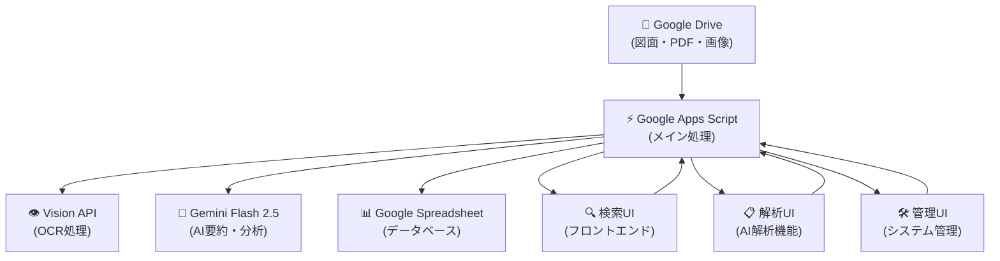

# 🏗️ デザイン事務所の「あの図面どこ？」問題をAIで解決した話

## 1. 結論：紙も電子も目的ファイルを探すのは大変

**「昨年のA案件の図面と見積を探して」**  
**「過去の和モダン店舗プロジェクト事例の設計図が欲しい」**

こんな曖昧な依頼、何かしらの設計図面を描く業態では日常茶飯事
日々中小企業の悩み事を聞いて回っていますが、多くの企業で同じ悩みをいただきます。

簡単な解決策としてGoogle driveにファイル置いて、gemini AI proプラン入っているアカウントなら、
ある程度の検索はgoogle driveの中で可能です。
しかしまだAIの波が来ていない地方都市の中小企業であったり、AI導入したいけど、上司がよくわからないもの※に固定費かけたくない、みたいなことで出し渋りする事例はよく聞きます。

ここからはちょっとぼやきですが、勉強しない向上心のない中高年の上役はいい加減にして欲しいところです

私の信条は「給料たくさんもらっている奴は、その分部下より頑張って見本になれよ」なので、
自分も土日でもvibecodingしたり勉強したり診断士業務したりサードプレイス運営したりと平日と変わらない生活しています

※みたいに上司がよくわらかないから導入踏み込めないって、上司酒飲んだり遊んでいる暇あったら勉強しろよと言いたくなる訳です。
...そうは言っても他人は変わらないので、テクノロジーで楽しましょというのが今日の本題

**従来の課題：**

ファイルを検索するという行為は、**データの種類によって検索性が大きく異なる**という根本的な問題があります。

### 📊 データ種別と検索性の課題

**🗃️ 構造化データ（検索しやすい）**
- データベースの顧客情報、プロジェクト管理表など
- フィールドが決まっているので条件検索が可能
- 例：「2025年」「蕎麦屋」「３階建」で絞り込み検索

**📄 非構造データ - テキスト系（まあまあ検索できる）**
- Word文書、テキスト部分があるPDFなど
- 全文検索は可能だが、文脈理解は困難
- 例：「平面図」で検索 → なんとかなる

**🖼️ 非構造データ - 画像系（従来は検索不可能）**
- 手書き図面をスキャンしたPDF、CADの画像出力、図面、写真など
- **ファイル名でしか検索できない** ← ここが最大の問題
- 図面の内容（間取り、構造、用途）は検索できない

### 🔍 設計事務所特有の検索困難性

- **📁 ファイル名だけでは内容がわからない**
  - 「250315_A案_修正版_final.pdf」← ( *｀ω´)ナニイッテルワカラナイ...
  - 「田中邸_平面図.pdf」← 1階？2階？どの田中さん？
フォルダ階層を辿って手動検索（10-30分）
「あれ、どこに保存したっけ？」構成管理が甘い問題も爆発
PDF・画像・CADファイルが混在して見れない、ソフト起動しまくる、PCリソースパンクして挙動遅くなってぶん投げたくなる

こんなもんですね。楽々明細のCMのような感じが、経理だけではなく総務でも起きているってことです。

**解決後の現実：**
- ⚡ 自然言語での検索（10-30秒）
- 🤖 AIが図面内容を理解して応答
- 📈 総務業務の80%以上を自動化

---

## 2. ペイン：総務は古いものを探すのに困っている

### 😰 よくある困りごと

**総務担当者の悲鳴：**
> 「先生、去年の◯◯プロジェクトの図面、どこでしたっけ？」  
> 「クライアントから類似事例の資料請求が...」  
> 「この建物の詳細図、見つかりません...」

**具体的な問題：**
- 🗂️ 過去の図面が大量に蓄積（数千〜数万ファイル）
- 📋 ファイル名の命名規則が統一されていない
- 🎯 欲しい図面の特定に時間がかかりすぎる
- 👥 担当者が変わると検索ノウハウが失われる

### 📊 業務への影響

```
従来の検索フロー：
依頼受信 → フォルダ探索 → ファイル確認 → 見つからない → 
再探索 → やっと発見 → 合計：10-30分

理想的なフロー：
依頼受信 → AI検索 → 即座に発見 → 合計：10-30秒
```

---

## 3. 対策：画像ファイルも図面も探せる仕組みの構築

### 🚀 開発したシステムの特徴

**🔍 自然言語検索エンジン**
- 「田中邸の平面図」「3階建ての店舗設計」など直感的な検索
- 曖昧なキーワードでもAIが内容を理解

**👁️ OCR + AI解析パイプライン**
- Google Cloud Vision API で図面・PDF・画像からテキスト抽出
- Gemini Flash 2.5 で図面内容を自動要約・分類

**📊 リアルタイム処理**
- 新しいドキュメントを自動で解析・検索対象に追加
- Google Drive連携で既存ワークフローを変更せず導入

**🎯 実用レベルの精度**
- 建築専門用語に対応
- プロジェクト名・クライアント名・建物種別での検索
- 図面種別（平面図・立面図・詳細図）の自動分類

### 💡 システムの特徴

```
入力例：「全文検索」
↓
AI理解：文書検索システム、技術文書
↓
出力：関連する平面図・立面図・詳細図を一括表示
```

---

## 4. アーキテクチャ図と使用技術スタック

### 🏗️ システム構成図



### 💻 使用技術スタック

**フロントエンド**
- HTML/CSS/JavaScript
- Google Apps Script Web App

**バックエンド**
- Google Apps Script (サーバーサイド JavaScript)
- Google Apps Script API

**データベース・ストレージ**
- Google Spreadsheet (メタデータ管理)
- Google Drive (ファイルストレージ)

**AI・機械学習**
- Google Cloud Vision API (OCR処理)
- Gemini Flash 2.5 API (文書要約・自然言語処理)

**開発・デプロイ**
- Google Apps Script IDE
- Google Web App (自動ホスティング)

### 🔧 技術選定の理由

**なぜGoogle Apps Script？**
- 🚀 **迅速な開発**: Googleエコシステムとの完全統合
- 💰 **低コスト**: サーバー管理不要、従量課金
- 🔒 **セキュリティ**: Google の企業レベルセキュリティ
- 🛠️ **メンテナンス性**: コード管理からデプロイまで一元化

**なぜGemini Flash 2.5？**
- ⚡ **高速処理**: レスポンス時間が短い
- 🎯 **高精度**: 日本語・建築専門用語に対応
- 💸 **コスト効率**: GPT-4より大幅に安価

---

## 5. 結論

### 🎯 導入効果

**定量的効果**
- 検索時間：**10-30分 → 10-30秒**（98%短縮）
- 秘書業務の自動化率：**80%以上**
- ファイル発見率：**90%以上**（従来50%程度）

**定性的効果**
- 📈 **業務効率の劇的改善**：曖昧な依頼でも瞬時に対応
- 😊 **ストレス軽減**：「見つからない」ストレスから解放
- 🎓 **知識の蓄積**：過去プロジェクトの活用機会増加
- 👥 **チーム連携**：担当者が変わっても検索ノウハウを維持

### 💡 学んだこと

**技術面**
- Google Apps Script の可能性は想像以上
- AI API の組み合わせで実用的なシステムが構築可能
- OCR + AI要約の組み合わせが図面検索に非常に有効

**ビジネス面**
- 小さな課題でも解決すると大きなインパクト
- 既存ワークフローを変えない導入がカギ
- ユーザーフィードバックが品質向上の最短経路

### 🚀 今後の展開

**短期改善**
- 検索精度のさらなる向上
- ユーザーインターフェースの改善
- パフォーマンス最適化

**長期ビジョン**
- 類似プロジェクト推薦機能
- CADソフトウェアとの直接連携
- 設計パターンの自動分析

### 📝 まとめ

**「あの図面どこ？」問題は、AI + 既存ツールの組み合わせで解決できる**

- 🎯 **課題**: 設計事務所の図面検索は非効率
- 💡 **解決**: OCR + AI要約 + 自然言語検索
- 🏗️ **技術**: Google Apps Script + Vision API + Gemini
- 📈 **結果**: 検索時間98%短縮、業務効率大幅向上

**現代のAI技術を使えば、専門分野の課題も実用レベルで解決できる時代になりました。**

---

### 🔗 関連リンク

- [プロジェクトリポジトリ](https://github.com/your-username/zenbun_gas)
- [Google Apps Script](https://script.google.com/)
- [Google Cloud Vision API](https://cloud.google.com/vision)
- [Gemini API](https://ai.google.dev/)

---

*Made with ❤️ for 設計事務所の業務効率化* 